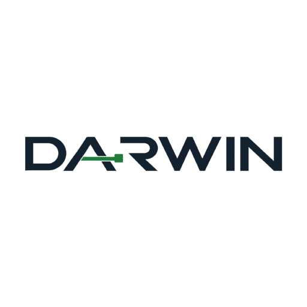

# DARWIN

**El marketing evoluciona solo.**

Hoy crear una aplicación no es el problema. El problema es la **distribución**: que alguien se entere, que alguien compre. Es el 90% del juego y sigue siendo artesanal.

DARWIN la automatiza con un ejército de agentes. Y lo hace con una diferencia: todo "AI marketer" **inventa** el marketing; DARWIN lo **extrae de evidencia** — de la frase textual que escribió una clienta real.

---

## Qué hace

Le das lo que tengas. Todo es opcional salvo lo primero:

- la **web** de tu producto
- el **export de conversaciones** con tus clientes (el `.txt` que WhatsApp deja descargar con dos taps — sin APIs, sin permisos)
- un **CSV de tus posts con métricas**, si lo tienes a mano
- un **CSV de reseñas**

Y entonces:

1. **El Panorama** investiga tu marca y te dice qué formatos te funcionan **con tus propios números**. Si no tienes historia suficiente, compara contra un dataset de benchmarks de categoría incluido en el repo: *"tú no tienes UGC; en tu categoría es el formato que más vende"*.
2. **El Oído** lee cientos de conversaciones y anota por qué compran, qué preguntan, qué los frena. Cada hallazgo guarda la **cita textual** y **cuántas veces se repite**. Los teléfonos y direcciones se borran al leer.
3. **El Banco de Ángulos** convierte los hallazgos en razones reales de compra. La mecánica núcleo: **la frase del cliente se invierte en promesa** — *"se destapa toda la noche"* → *"la cobijita que sí se queda puesta"*.
4. **El Estratega** cruza ángulos × formatos × canales y arma el plan de testing: cuántos anuncios, con qué presupuesto, con qué regla se matan y con cuál se escalan.
5. **El Ejército** ejecuta en paralelo con 5 especialistas: paid, contenido orgánico, creators/UGC, email y blog.
6. **La selección natural** decide. Los que no dan señal mueren; los que venden se gradúan y **se reproducen** en variantes mutadas.
7. **La Memoria** aprende qué ángulos y formatos venden para TU marca. La próxima corrida no arranca de cero.

**El freno eres tú.** Nada sale de `draft` sin GO humano.

---

## Correrlo

```bash
npm install
npm run demo        # war room + corrida oficial pre-grabada, en http://localhost:3000
```

`npm run demo` **no gasta un solo token** y funciona sin red.

Para una corrida en vivo contra la API:

```bash
cp .env.example .env    # pega tu ANTHROPIC_API_KEY
npm run pipeline demo/
```

Verificar sin gastar nada:

```bash
npm run check       # contrato, parser de ingesta y honestidad del simulador
```

---

## Decisiones que vale la pena conocer

**La cita es obligatoria en el schema.** `AdDraft.source_quote` es un campo requerido por Zod. Un anuncio que no puede señalar la frase de la clienta que lo originó no pasa la validación. La trazabilidad no es una convención: es un tipo.

**Los enums están blindados de nacimiento.** Si el modelo inventa un valor, Zod lo rechaza y el runtime reintenta inyectándole el error de parse. Un enum abierto se corrompe en producción.

**Ninguna fuente es requerida.** Las cuatro fuentes del Panorama corren en paralelo con timeout; la que falla registra su estado en un panel de **cobertura** visible y el pipeline sigue. Con solo web + conversaciones, DARWIN entrega estrategia completa. **Nunca depende de Instagram.**

**El simulador es honesto.** La vista de evolución está rotulada como *simulación con supuestos de categoría*, nunca como predicción. Y está verificada para no ser propaganda: sobre 300 corridas el anuncio mediano queda en **1.93x de ROAS**, por debajo del umbral de graduación — solo el p90 lo supera. La evidencia predice pero no manda: el ángulo mejor respaldado gana 5 veces más que el peor, no siempre.

**Sin pronóstico de CAC.** Sin tu historial sería falsa precisión. DARWIN dice qué probar y cómo se va a medir, no cuánto te va a costar un cliente.

---

## Stack

Node 22 + TypeScript vía `tsx` (cero build) · Hono con SSE nativo · frontend vanilla sin CDN · Zod validando cada escritura · Claude vía `@anthropic-ai/sdk` con tool-use forzado para JSON garantizado. Sin framework de agentes: el pipeline es un DAG determinista y un "agente" es system prompt + schema + modelo.

## Licencia

MIT.

---

<sub>

**Platanus Build Night — Bogotá @ Buk**

Hacker: Julian David Castro ([@jdcastro2](https://github.com/jdcastro2))

### Deploying (Vercel, Render, etc.)

Las plataformas de deploy solo pueden conectarse a repositorios **propios**. Para desplegar manteniendo los commits acá, replica el código a un repo personal:

```bash
git remote set-url --add --push origin https://github.com/platanus-build-night/platanus-build-night-26-co-jdcastro2.git
git remote set-url --add --push origin https://github.com/<tu-usuario>/<tu-repo>.git
```

Desde ahí, `git push` envía cada commit a ambos repositorios, y el deploy corre desde el repo propio.

</sub>
